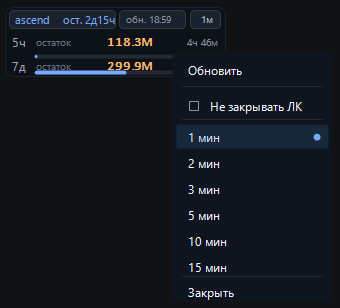

# NeuroGate API 1.1

Compact Windows overlay for NeuroGate API usage limits.

The app reads `https://portal.neurogate.space/client/usage` through a local
Chrome profile and shows a small always-on-top desktop widget with the current
credit limits. By default the browser window is hidden after login. A visible
Chrome window opens only when the user needs to log in again.

## Screenshot



## Current UI

The current NeuroGate limits page exposes fewer public values than the previous
NeuroGate UI. The overlay intentionally shows only the data that is currently
available on the page:

- account name;
- tariff time remaining;
- 5-hour credit balance;
- 7-day credit balance;
- portal-matched progress bars for each limit window;
- reset time for each window;
- last refresh status;
- refresh interval.

Older fields such as token totals, cache totals, and `used / total` tariff
pairs are no longer shown because the new page does not expose them in the same
visible layout. The overlay does not show projected totals or old saved usage
snapshots; it shows only fresh data read from the current browser session.

## Privacy

The overlay is local-first.

- It does not ask for your NeuroGate password.
- It does not collect API keys.
- It does not send usage data to this project, to a server, or to analytics.
- It reads only the text already visible in your own browser session.
- Browser cookies stay on your computer in a local Playwright/Chrome profile.
- After successful login, the visible Chrome window is hidden and future reads
  continue from the same local browser session.
- The right-click menu includes `Не закрывать ЛК`. When enabled, the account
  page stays open in a separate Chrome window. When disabled, that window is
  hidden again.
- The overlay does not store old limit snapshots for fallback display.

Default local profile path:

```text
%USERPROFILE%\.neurogate-usage-overlay\browser-profile
```

Do not publish or share that folder.

## Requirements

- Windows 10/11
- Python 3.10+
- Google Chrome
- Internet access to the NeuroGate portal

## Install

From GitHub:

```powershell
git clone https://github.com/RyandavisProject/neurogate-overlay.git
cd neurogate-overlay
powershell -ExecutionPolicy Bypass -File .\scripts\install.ps1
```

Or double-click:

```text
scripts\install.bat
```

The installer creates:

- local Python virtual environment in `.venv/`;
- editable Python package installation;
- desktop shortcut named `NeuroGate API`.

## Run

```powershell
powershell -ExecutionPolicy Bypass -File .\scripts\run-overlay.ps1
```

Or double-click the desktop shortcut:

```text
NeuroGate API
```

First run:

1. The overlay first tries to read the usage page in hidden mode.
2. If login is required, Chrome opens with a separate local browser profile.
3. Log in directly on the NeuroGate website.
4. After the first successful read, the visible Chrome window is hidden.
5. Future updates continue from the same local browser session.
6. While login is required, the overlay checks every few seconds and picks up a
   successful login quickly.
7. With fresh data loaded, the widget refreshes no more often than once per
   minute unless you choose manual refresh.

If you need to keep the account page visible, right-click the overlay and turn
on `Не закрывать ЛК`. Turn it off to hide the visible Chrome window again. This
choice is runtime-only; the next normal launch returns to hidden mode unless
you start the app with `--show-browser`.

## Controls

- Drag the overlay by any visible area.
- The last window position is saved locally and restored on the next launch.
- Left-click the interval pill, for example `1м`, to cycle refresh intervals.
- Right-click the overlay to open the compact menu.
- In the menu, `Не закрывать ЛК` keeps the NeuroGate account page open in a
  separate Chrome window until you turn it off.
- Press `Esc` to close the overlay.
- Press `Ctrl+R` to refresh, respecting the 1-minute minimum refresh guard.

## Useful Commands

Install:

```powershell
powershell -ExecutionPolicy Bypass -File .\scripts\install.ps1
```

Create desktop shortcut again:

```powershell
powershell -ExecutionPolicy Bypass -File .\scripts\create-desktop-shortcut.ps1
```

Run overlay:

```powershell
powershell -ExecutionPolicy Bypass -File .\scripts\run-overlay.ps1
```

Keep browser visible for debugging:

```powershell
.\.venv\Scripts\python.exe -m neurogate_usage_overlay --show-browser
```

Run one console check:

```powershell
powershell -ExecutionPolicy Bypass -File .\scripts\run-once.ps1
```

Run project checks:

```powershell
powershell -ExecutionPolicy Bypass -File .\scripts\check.ps1
```

## AI Install Prompt

For Codex, Claude Code, or another local coding agent, the short command is:

```text
Install NeuroGate API from https://github.com/RyandavisProject/neurogate-overlay
```

If the agent asks for more detail, use:

```text
Install NeuroGate API from https://github.com/RyandavisProject/neurogate-overlay.
Read docs/AI_INSTALL_PROMPT.md, follow it exactly, install dependencies, create
a desktop shortcut, launch the overlay, and give me a short installation report
in plain language.
```

The detailed prompt is stored in:

```text
docs/AI_INSTALL_PROMPT.md
```

## Project Structure

```text
neurogate-overlay/
  src/neurogate_usage_overlay/
    __main__.py          CLI entrypoint
    browser_reader.py    Playwright browser/session reader
    models.py            Typed usage data model
    overlay.py           Tkinter desktop overlay UI
    parser.py            Visible page text parser
  scripts/
    install.ps1
    run-overlay.ps1
    run-once.ps1
    create-desktop-shortcut.ps1
    check.ps1
  docs/
    AI_INSTALL_PROMPT.md
    ARCHITECTURE.md
    PRIVACY.md
    PUBLISHING.md
    screenshots/
      overlay.png
  tests/
    test_browser_reader.py
    test_overlay.py
    test_parser.py
    test_projection.py
```

## Development

```powershell
powershell -ExecutionPolicy Bypass -File .\scripts\check.ps1
```

The test suite currently covers both known page formats:

- old NeuroGate page with `24 часа / 7 дней` and tariff limit pairs;
- current NeuroGate page with `5 часов / 7 дней` and remaining credits.

## Limitations

- The parser reads visible page text. If NeuroGate changes labels or page layout,
  the parser may need a small update.
- The app is Windows-focused because it uses Tkinter desktop behavior and
  Windows shortcut scripts.
- The app does not bypass login or session expiry. If the site logs you out, the
  overlay opens a visible Chrome window so you can log in again. After a
  successful read, it returns to hidden mode.
- The overlay intentionally does not show stored fallback values. If the portal
  requires login or does not expose the limits, the widget shows that state
  instead of old numbers.

## License

MIT. See `LICENSE`.


